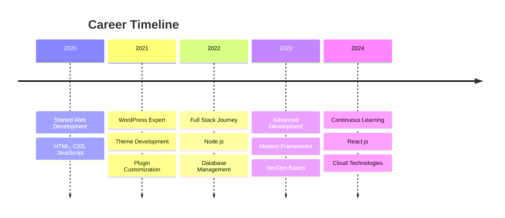

# Alternative GitHub Profile Templates

## 🎨 Theme Variations

Anda bisa mengganti theme dengan mengubah parameter `theme=` pada URL stats. Berikut beberapa pilihan:

### 1. Dark Theme
```markdown

```

### 2. Blue Theme  
```markdown

```

### 3. Dracula Theme
```markdown

```

### 4. Synthwave Theme
```markdown

```

---

## 🚀 Additional Widgets

### Wakatime Stats (Coding Time Tracker)
Jika Anda menggunakan Wakatime untuk tracking coding time:

```markdown
[](https://wakatime.com/@Setya-Himawan)
```

### Spotify Playing Now
Untuk menampilkan musik yang sedang diputar:

```markdown
[](https://spotify-github-profile.vercel.app/api/spotify-playing)
```

### Blog Posts (Dev.to)
Jika Anda memiliki blog di Dev.to:

```markdown
### 📝 Latest Blog Posts
<!-- BLOG-POST-LIST:START -->
<!-- BLOG-POST-LIST:END -->
```

---

## 🎮 More Interactive Games

### Chess Game
```markdown
<div align="center">
  
### ♟️ Let's Play Chess!
  
[](https://lichess.org/)
  
**Challenge me to a game!** Click above to play.
  
</div>
```

### Code Wars Badge
```markdown

```

### HackerRank Badge
```markdown
[](https://www.hackerrank.com/profile/your-username)
```

---

## 📊 Advanced Analytics

### Repository Traffic
Untuk menampilkan traffic repository (hanya untuk repository milik sendiri):

```markdown
### 🔥 Repository Analytics


```

### Commit Calendar Heatmap
```markdown
### 📅 Contribution Heatmap


```

### Lines of Code Counter
```markdown
### 💻 Total Lines of Code


```

---

## 🎯 Professional Sections

### Skills Matrix
```markdown
## 🛠️ Skills & Proficiency

| Skill | Proficiency |
|-------|-------------|
| HTML5 | ████████████ 95% |
| CSS3 | ███████████ 90% |
| JavaScript | ████████ 80% |
| Node.js | ███████ 70% |
| Bootstrap | ██████████ 85% |
| WordPress | ████████████ 95% |
```

### Current Learning
```markdown
## 📚 Currently Learning

- [ ] React.js Advanced Patterns
- [ ] TypeScript
- [ ] GraphQL
- [ ] Docker & Kubernetes
- [ ] AWS Cloud Services
```

### Work Experience Timeline
```markdown
## 💼 Professional Journey



---

## 🌐 Multi-language Support

### English Version Header
```markdown
<div align="center">
  
</div>
```

### Indonesian Version Header
```markdown
<div align="center">
  
</div>
```

---

## 🎨 Custom Banners

### Create Custom Header
Anda bisa membuat header kustom di:
1. **Canva**: canva.com - Template "GitHub Banner"
2. **Figma**: figma.com - Community templates
3. **Banner Maker**: github.com/kyechan99/capsule-render

### Dynamic Banners
```markdown

```

---

**💡 Tips**: Simpan template-template ini dan gunakan sesuai kebutuhan untuk variasi profile Anda!